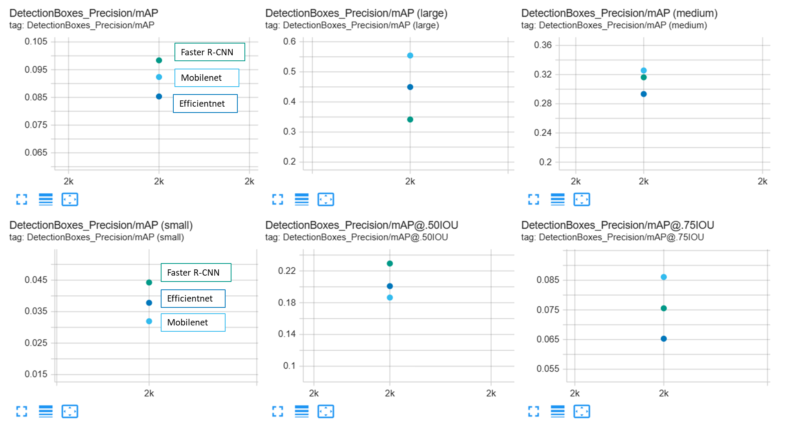
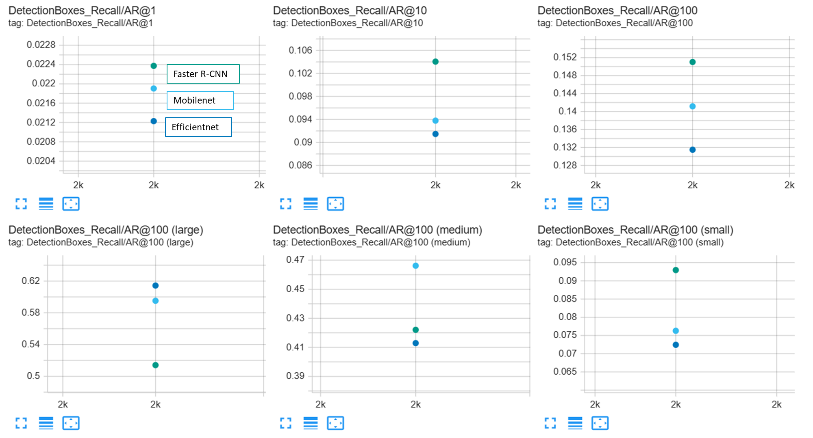
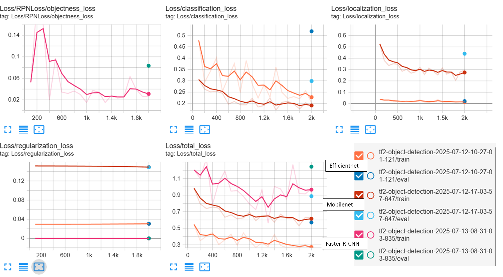

# Object detection in an urban environment

Objective: training an object detection model using Tensorflow Object Detection API, AWS Sagemaker and transfer learning.

<p align="center">
    
</p>

## Data

Train data is from camera images of the Waymo Open Dataset. As a first step the images with groundtruth from the training data were downloaded (in .tfrecord format) to get an idea of what the training data contained. A few of the images were displayed using matplotlib and a statistic of the groundtruth classes across the train data was calculated. The statistic shows that a vast majority of the dataset contains vehicles, less pedastrians and very few cyclists.

| Vehicles | Pedestrians | Cyclists |
| -------- | ------- | ------- |
| 77%  |  22%   | 1%    |

## Model testing

The models tested for this project were 3 pre-trained models available in the TensorFlow 2 Object Detection Model Zoo. For each a specific pipeline configuration was used. The config was edited wrt to the one available from Model Zoo to set the path for the train and eval data (and object labels map) and to set the classes number to the one relevant for this project ("3").

| Model | Config file | Result video |
| -------- | ------- | ------- |
| EfficientDet D1  |  [pipeline.config](https://github.com/gave92/Udacity-Project1/blob/29985991397fd4fbfe87ed3635c65e79716f2e52/1_model_training/source_dir/pipeline.config)  |  |
| SSD with Mobilenet v2 FPN-lite  |  [pipeline_mobile.config](https://github.com/gave92/Udacity-Project1/blob/29985991397fd4fbfe87ed3635c65e79716f2e52/1_model_training/source_dir/pipeline_mobile.config)  |  |
| Faster R-CNN with Resnet-50 (v1)  |  [pipeline_rcnn.config](https://github.com/gave92/Udacity-Project1/blob/29985991397fd4fbfe87ed3635c65e79716f2e52/1_model_training/source_dir/pipeline_rcnn.config)   |  |

The training loss and validation mAP (both precision and recall) for each model was visualized using Tensorboard.




Based on mAP metrics the best overall model appears to be Faster R-CNN which has the highest overall mAP, though it has lower precision that both the other models when detecting large objectes. In addition the loss function for Faster R-CNN could suggest an instability of the model during training, as it is not steadily decaying. Posssibly lowering the learning rate could help with that.

## Data augmentation options

A few data augmentation options were tested by modifying the config files adding "data_augmentation_options {}" sections, e.g:
```
random_horizontal_flip {
}

random_scale_crop_and_pad_to_square {
  output_size: 640
  scale_min: 0.10000000149011612
  scale_max: 2.0
}

random_adjust_brightness {
  max_delta: 0.2
}

random_distort_color {
  color_ordering: 1
}

random_black_patches {
  max_black_patches: 20
  size_to_image_ratio: 0.12
}
```
To visualize the augmentations they were run on a sample image, using: [displayDataAugmentations.py](https://github.com/gave92/Udacity-Project1/blob/29985991397fd4fbfe87ed3635c65e79716f2e52/scripts/displayDataAugmentations.py).
